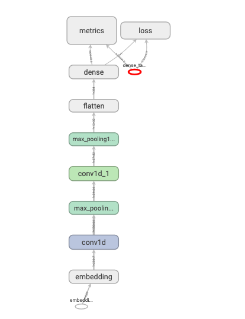

# 6-1,构建模型的3种方法


可以使用以下3种方式构建模型：使用Sequential按层顺序构建模型，使用函数式API构建任意结构模型，继承Model基类构建自定义模型。

对于顺序结构的模型，优先使用Sequential方法构建。

如果模型有多输入或者多输出，或者模型需要共享权重，或者模型具有残差连接等非顺序结构，推荐使用函数式API进行创建。

如果无特定必要，尽可能避免使用Model子类化的方式构建模型，这种方式提供了极大的灵活性，但也有更大的概率出错。

下面以IMDB电影评论的分类问题为例，演示3种创建模型的方法。

```python
import numpy as np 
import pandas as pd 
import tensorflow as tf
from tqdm import tqdm 
from tensorflow.keras import *


train_token_path = "./data/imdb/train_token.csv"
test_token_path = "./data/imdb/test_token.csv"

MAX_WORDS = 10000  # We will only consider the top 10,000 words in the dataset
MAX_LEN = 200  # We will cut reviews after 200 words
BATCH_SIZE = 20 

# 构建管道
def parse_line(line):
    t = tf.strings.split(line,"\t")
    label = tf.reshape(tf.cast(tf.strings.to_number(t[0]),tf.int32),(-1,))
    features = tf.cast(tf.strings.to_number(tf.strings.split(t[1]," ")),tf.int32)
    return (features,label)

ds_train=  tf.data.TextLineDataset(filenames = [train_token_path]) \
   .map(parse_line,num_parallel_calls = tf.data.experimental.AUTOTUNE) \
   .shuffle(buffer_size = 1000).batch(BATCH_SIZE) \
   .prefetch(tf.data.experimental.AUTOTUNE)

ds_test=  tf.data.TextLineDataset(filenames = [test_token_path]) \
   .map(parse_line,num_parallel_calls = tf.data.experimental.AUTOTUNE) \
   .shuffle(buffer_size = 1000).batch(BATCH_SIZE) \
   .prefetch(tf.data.experimental.AUTOTUNE)

```

```python

```

### 一，Sequential按层顺序创建模型

```python
tf.keras.backend.clear_session()

model = models.Sequential()

model.add(layers.Embedding(MAX_WORDS,7,input_length=MAX_LEN))
model.add(layers.Conv1D(filters = 64,kernel_size = 5,activation = "relu"))
model.add(layers.MaxPool1D(2))
model.add(layers.Conv1D(filters = 32,kernel_size = 3,activation = "relu"))
model.add(layers.MaxPool1D(2))
model.add(layers.Flatten())
model.add(layers.Dense(1,activation = "sigmoid"))

model.compile(optimizer='Nadam',
            loss='binary_crossentropy',
            metrics=['accuracy',"AUC"])

model.summary()
```



```python
import datetime
baselogger = callbacks.BaseLogger(stateful_metrics=["AUC"])
logdir = "./data/keras_model/" + datetime.datetime.now().strftime("%Y%m%d-%H%M%S")
tensorboard_callback = tf.keras.callbacks.TensorBoard(logdir, histogram_freq=1)
history = model.fit(ds_train,validation_data = ds_test,
        epochs = 6,callbacks=[baselogger,tensorboard_callback])

```

```python
%matplotlib inline
%config InlineBackend.figure_format = 'svg'

import matplotlib.pyplot as plt

def plot_metric(history, metric):
    train_metrics = history.history[metric]
    val_metrics = history.history['val_'+metric]
    epochs = range(1, len(train_metrics) + 1)
    plt.plot(epochs, train_metrics, 'bo--')
    plt.plot(epochs, val_metrics, 'ro-')
    plt.title('Training and validation '+ metric)
    plt.xlabel("Epochs")
    plt.ylabel(metric)
    plt.legend(["train_"+metric, 'val_'+metric])
    plt.show()
```

```python
plot_metric(history,"AUC")
```

```python

```

```python

```

```python

```

### 二，函数式API创建任意结构模型

```python
tf.keras.backend.clear_session()

inputs = layers.Input(shape=[MAX_LEN])
x  = layers.Embedding(MAX_WORDS,7)(inputs)

branch1 = layers.SeparableConv1D(64,3,activation="relu")(x)
branch1 = layers.MaxPool1D(3)(branch1)
branch1 = layers.SeparableConv1D(32,3,activation="relu")(branch1)
branch1 = layers.GlobalMaxPool1D()(branch1)

branch2 = layers.SeparableConv1D(64,5,activation="relu")(x)
branch2 = layers.MaxPool1D(5)(branch2)
branch2 = layers.SeparableConv1D(32,5,activation="relu")(branch2)
branch2 = layers.GlobalMaxPool1D()(branch2)

branch3 = layers.SeparableConv1D(64,7,activation="relu")(x)
branch3 = layers.MaxPool1D(7)(branch3)
branch3 = layers.SeparableConv1D(32,7,activation="relu")(branch3)
branch3 = layers.GlobalMaxPool1D()(branch3)

concat = layers.Concatenate()([branch1,branch2,branch3])
outputs = layers.Dense(1,activation = "sigmoid")(concat)

model = models.Model(inputs = inputs,outputs = outputs)

model.compile(optimizer='Nadam',
            loss='binary_crossentropy',
            metrics=['accuracy',"AUC"])

model.summary()

```


```python
import datetime
logdir = "./data/keras_model/" + datetime.datetime.now().strftime("%Y%m%d-%H%M%S")
tensorboard_callback = tf.keras.callbacks.TensorBoard(logdir, histogram_freq=1)
history = model.fit(ds_train,validation_data = ds_test,epochs = 6,callbacks=[tensorboard_callback])

```

```python
plot_metric(history,"AUC")
```

```python

```

### 三，Model子类化创建自定义模型

```python
# 先自定义一个残差模块，为自定义Layer

class ResBlock(layers.Layer):
    def __init__(self, kernel_size, **kwargs):
        super(ResBlock, self).__init__(**kwargs)
        self.kernel_size = kernel_size
    
    def build(self,input_shape):
        self.conv1 = layers.Conv1D(filters=64,kernel_size=self.kernel_size,
                                   activation = "relu",padding="same")
        self.conv2 = layers.Conv1D(filters=32,kernel_size=self.kernel_size,
                                   activation = "relu",padding="same")
        self.conv3 = layers.Conv1D(filters=input_shape[-1],
                                   kernel_size=self.kernel_size,activation = "relu",padding="same")
        self.maxpool = layers.MaxPool1D(2)
        super(ResBlock,self).build(input_shape) # 相当于设置self.built = True
    
    def call(self, inputs):
        x = self.conv1(inputs)
        x = self.conv2(x)
        x = self.conv3(x)
        x = layers.Add()([inputs,x])
        x = self.maxpool(x)
        return x
    
    #如果要让自定义的Layer通过Functional API 组合成模型时可以序列化，需要自定义get_config方法。
    def get_config(self):  
        config = super(ResBlock, self).get_config()
        config.update({'kernel_size': self.kernel_size})
        return config
```

```python
# 测试ResBlock
resblock = ResBlock(kernel_size = 3)
resblock.build(input_shape = (None,200,7))
resblock.compute_output_shape(input_shape=(None,200,7))

```

```python
# 自定义模型，实际上也可以使用Sequential或者FunctionalAPI

tf.keras.backend.clear_session()

class ImdbModel(models.Model):
    def __init__(self):
        super(ImdbModel, self).__init__()
        
    def build(self,input_shape):
        self.embedding = layers.Embedding(MAX_WORDS,7)
        self.block1 = ResBlock(7)
        self.block2 = ResBlock(5)
        self.dense = layers.Dense(1,activation = "sigmoid")
        super(ImdbModel,self).build(input_shape)
    
    def call(self, x):
        x = self.embedding(x)
        x = self.block1(x)
        x = self.block2(x)
        x = layers.Flatten()(x)
        x = self.dense(x)
        return(x)
    
```

```python
model = ImdbModel()
model.build(input_shape =(None,200))
model.summary()

model.compile(optimizer='Nadam',
            loss='binary_crossentropy',
            metrics=['accuracy',"AUC"])

```

```python

```


```python

```

```python
import datetime

logdir = "./tflogs/keras_model/" + datetime.datetime.now().strftime("%Y%m%d-%H%M%S")
tensorboard_callback = tf.keras.callbacks.TensorBoard(logdir, histogram_freq=1)
history = model.fit(ds_train,validation_data = ds_test,
                    epochs = 6,callbacks=[tensorboard_callback])

```

```python
plot_metric(history,"AUC")
```

```python

```

如果对本书内容理解上有需要进一步和作者交流的地方，欢迎在公众号"Python与算法之美"下留言。作者时间和精力有限，会酌情予以回复。


```python

```
