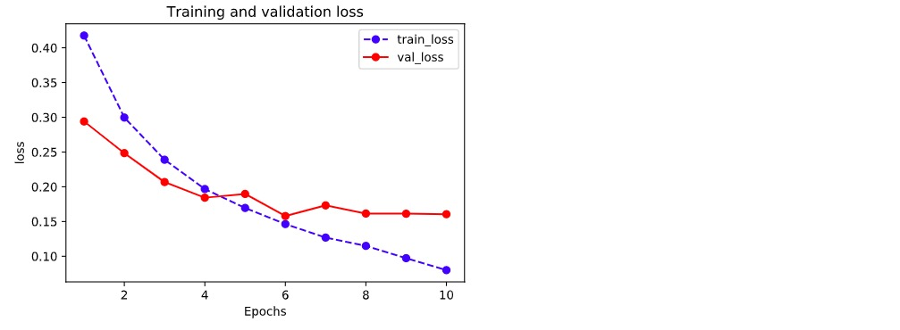
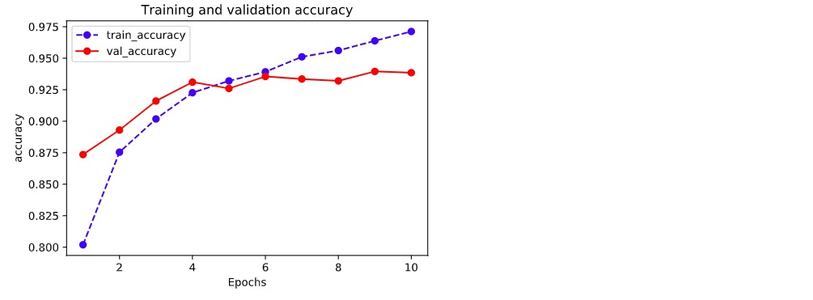

# 1-2 Example: Modeling Procedure for Images


### 1. Data Preparation


The cifar2 dataset is a sub-set of cifar10, which only contains two classes: airplane and automobile.

Each class contains 5000 images for training and 1000 images for testing.

The goal for this task is to train a model to classify images as airplane or automobile.

The files of cifar2 are organized as below:


```python

```

There are two ways of image preparation in TensorFlow.

The first one is constructing the image data generator using ImageDataGenerator in tf.keras.

The second one is constructing data pipeline using tf.data.Dataset and several methods in tf.image

The former is simpler and is demonstrated in [this article](https://zhuanlan.zhihu.com/p/67466552) (in Chinese).

The latter is the original method of TensorFlow, which is more flexible with possible better performance with proper usage.

Below is the introduction to the second method.


```python
import tensorflow as tf 
from tensorflow.keras import datasets,layers,models

BATCH_SIZE = 100

def load_image(img_path,size = (32,32)):
    label = tf.constant(1,tf.int8) if tf.strings.regex_full_match(img_path,".*/automobile/.*") \
            else tf.constant(0,tf.int8)
    img = tf.io.read_file(img_path)
    img = tf.image.decode_jpeg(img) #In jpeg format
    img = tf.image.resize(img,size)/255.0
    return(img,label)

```

```python
#Parallel pre-processing using num_parallel_calls and caching data with prefetch function to improve the performance
ds_train = tf.data.Dataset.list_files("./data/cifar2/train/*/*.jpg") \
           .map(load_image, num_parallel_calls=tf.data.experimental.AUTOTUNE) \
           .shuffle(buffer_size = 1000).batch(BATCH_SIZE) \
           .prefetch(tf.data.experimental.AUTOTUNE)  

ds_test = tf.data.Dataset.list_files("./data/cifar2/test/*/*.jpg") \
           .map(load_image, num_parallel_calls=tf.data.experimental.AUTOTUNE) \
           .batch(BATCH_SIZE) \
           .prefetch(tf.data.experimental.AUTOTUNE)  

```

```python
%matplotlib inline
%config InlineBackend.figure_format = 'svg'

#Checking part of the samples
from matplotlib import pyplot as plt 

plt.figure(figsize=(8,8)) 
for i,(img,label) in enumerate(ds_train.unbatch().take(9)):
    ax=plt.subplot(3,3,i+1)
    ax.imshow(img.numpy())
    ax.set_title("label = %d"%label)
    ax.set_xticks([])
    ax.set_yticks([]) 
plt.show()

```


```python
for x,y in ds_train.take(1):
    print(x.shape,y.shape)
```

```
(100, 32, 32, 3) (100,)
```

```python

```

### 2. Model Definition


Usually there are three ways of modeling using APIs of Keras: sequential modeling using `Sequential()` function, arbitrary modeling using API functions, and customized modeling by inheriting base class `Model`.

Here we use API functions for modeling.

```python
tf.keras.backend.clear_session() #Clearing the session

inputs = layers.Input(shape=(32,32,3))
x = layers.Conv2D(32,kernel_size=(3,3))(inputs)
x = layers.MaxPool2D()(x)
x = layers.Conv2D(64,kernel_size=(5,5))(x)
x = layers.MaxPool2D()(x)
x = layers.Dropout(rate=0.1)(x)
x = layers.Flatten()(x)
x = layers.Dense(32,activation='relu')(x)
outputs = layers.Dense(1,activation = 'sigmoid')(x)

model = models.Model(inputs = inputs,outputs = outputs)

model.summary()
```

```
Model: "model"
_________________________________________________________________
Layer (type)                 Output Shape              Param #   
=================================================================
input_1 (InputLayer)         [(None, 32, 32, 3)]       0         
_________________________________________________________________
conv2d (Conv2D)              (None, 30, 30, 32)        896       
_________________________________________________________________
max_pooling2d (MaxPooling2D) (None, 15, 15, 32)        0         
_________________________________________________________________
conv2d_1 (Conv2D)            (None, 11, 11, 64)        51264     
_________________________________________________________________
max_pooling2d_1 (MaxPooling2 (None, 5, 5, 64)          0         
_________________________________________________________________
dropout (Dropout)            (None, 5, 5, 64)          0         
_________________________________________________________________
flatten (Flatten)            (None, 1600)              0         
_________________________________________________________________
dense (Dense)                (None, 32)                51232     
_________________________________________________________________
dense_1 (Dense)              (None, 1)                 33        
=================================================================
Total params: 103,425
Trainable params: 103,425
Non-trainable params: 0
_________________________________________________________________
```

```python

```

### 3. Model Training


There are three usual ways for model training: use internal function fit, use internal function train_on_batch, and customized training loop. Here we introduce the simplist way: using internal function fit.

```python
import datetime

logdir = "./data/keras_model/" + datetime.datetime.now().strftime("%Y%m%d-%H%M%S")
tensorboard_callback = tf.keras.callbacks.TensorBoard(logdir, histogram_freq=1)

model.compile(
        optimizer=tf.keras.optimizers.Adam(learning_rate=0.001),
        loss=tf.keras.losses.binary_crossentropy,
        metrics=["accuracy"]
    )

history = model.fit(ds_train,epochs= 10,validation_data=ds_test,
                    callbacks = [tensorboard_callback],workers = 4)

```

```
Train for 100 steps, validate for 20 steps
Epoch 1/10
100/100 [==============================] - 16s 156ms/step - loss: 0.4830 - accuracy: 0.7697 - val_loss: 0.3396 - val_accuracy: 0.8475
Epoch 2/10
100/100 [==============================] - 14s 142ms/step - loss: 0.3437 - accuracy: 0.8469 - val_loss: 0.2997 - val_accuracy: 0.8680
Epoch 3/10
100/100 [==============================] - 13s 131ms/step - loss: 0.2871 - accuracy: 0.8777 - val_loss: 0.2390 - val_accuracy: 0.9015
Epoch 4/10
100/100 [==============================] - 12s 117ms/step - loss: 0.2410 - accuracy: 0.9040 - val_loss: 0.2005 - val_accuracy: 0.9195
Epoch 5/10
100/100 [==============================] - 13s 130ms/step - loss: 0.1992 - accuracy: 0.9213 - val_loss: 0.1949 - val_accuracy: 0.9180
Epoch 6/10
100/100 [==============================] - 14s 136ms/step - loss: 0.1737 - accuracy: 0.9323 - val_loss: 0.1723 - val_accuracy: 0.9275
Epoch 7/10
100/100 [==============================] - 14s 139ms/step - loss: 0.1531 - accuracy: 0.9412 - val_loss: 0.1670 - val_accuracy: 0.9310
Epoch 8/10
100/100 [==============================] - 13s 134ms/step - loss: 0.1299 - accuracy: 0.9525 - val_loss: 0.1553 - val_accuracy: 0.9340
Epoch 9/10
100/100 [==============================] - 14s 137ms/step - loss: 0.1158 - accuracy: 0.9556 - val_loss: 0.1581 - val_accuracy: 0.9340
Epoch 10/10
100/100 [==============================] - 14s 142ms/step - loss: 0.1006 - accuracy: 0.9617 - val_loss: 0.1614 - val_accuracy: 0.9345
```

```python

```

### 4. Model Evaluation

```python
#%load_ext tensorboard
#%tensorboard --logdir ./data/keras_model
```

```python
from tensorboard import notebook
notebook.list() 
```

```python
#Checking model in tensorboard
notebook.start("--logdir ./data/keras_model")
```

```python

```


```python
import pandas as pd 
dfhistory = pd.DataFrame(history.history)
dfhistory.index = range(1,len(dfhistory) + 1)
dfhistory.index.name = 'epoch'

dfhistory
```


```python
%matplotlib inline
%config InlineBackend.figure_format = 'svg'

import matplotlib.pyplot as plt

def plot_metric(history, metric):
    train_metrics = history.history[metric]
    val_metrics = history.history['val_'+metric]
    epochs = range(1, len(train_metrics) + 1)
    plt.plot(epochs, train_metrics, 'bo--')
    plt.plot(epochs, val_metrics, 'ro-')
    plt.title('Training and validation '+ metric)
    plt.xlabel("Epochs")
    plt.ylabel(metric)
    plt.legend(["train_"+metric, 'val_'+metric])
    plt.show()
```

```python
plot_metric(history,"loss")
```



```python
plot_metric(history,"accuracy")
```



```python
#Evaluating data using model.evaluate function
val_loss,val_accuracy = model.evaluate(ds_test,workers=4)
print(val_loss,val_accuracy)

```

```
0.16139143370091916 0.9345
```


### 5. Model Application


We can use model.predict(ds_test) for prediction.

We can also use model.predict_on_batch(x_test) to predict a batch of data.

```python
model.predict(ds_test)
```

```
array([[9.9996173e-01],
       [9.5104784e-01],
       [2.8648047e-04],
       ...,
       [1.1484033e-03],
       [3.5589080e-02],
       [9.8537153e-01]], dtype=float32)
```

```python
for x,y in ds_test.take(1):
    print(model.predict_on_batch(x[0:20]))
```

```
tf.Tensor(
[[3.8065155e-05]
 [8.8236779e-01]
 [9.1433197e-01]
 [9.9921846e-01]
 [6.4052093e-01]
 [4.9970779e-03]
 [2.6735585e-04]
 [9.9842811e-01]
 [7.9198682e-01]
 [7.4823302e-01]
 [8.7208226e-03]
 [9.3951421e-03]
 [9.9790359e-01]
 [9.9998581e-01]
 [2.1642199e-05]
 [1.7915063e-02]
 [2.5839690e-02]
 [9.7538447e-01]
 [9.7393811e-01]
 [9.7333014e-01]], shape=(20, 1), dtype=float32)
```


```python

```

### 6. Model Saving


We recommend model saving with the original way of TensorFlow.

```python
# Saving the weights, this way only save the tensors of the weights
model.save_weights('./data/tf_model_weights.ckpt',save_format = "tf")
```

```python
# Saving model structure and parameters to a file, so the model allows cross-platform deployment

model.save('./data/tf_model_savedmodel', save_format="tf")
print('export saved model.')

model_loaded = tf.keras.models.load_model('./data/tf_model_savedmodel')
model_loaded.evaluate(ds_test)
```

```
[0.16139124035835267, 0.9345]
```

```python

```

Please leave comments in the WeChat official account "Python与算法之美" (Beauty of Python and Algorithms) if you want to communicate with the author about the content. The author will try best to reply given the limited time available.

You are also welcomed to reply **加群(join group)** in the WeChat official account to join the group chat with the other readers.


