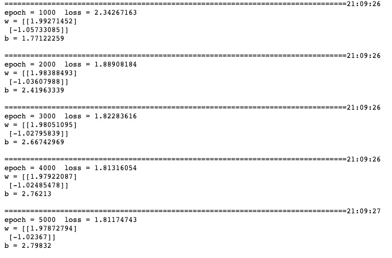

# 3-1 Low-level API: Demonstration

The examples below use low-level APIs in TensorFlow to implement a linear regression model.

Low-level API includes tensor operation, graph and automatic differentiates.

```python
import tensorflow as tf

# Print time stamps
@tf.function
def printbar():
    ts = tf.timestamp()
    today_ts = ts%(24*60*60)

    hour = tf.cast(today_ts//3600+8,tf.int32)%tf.constant(24)
    minite = tf.cast((today_ts%3600)//60,tf.int32)
    second = tf.cast(tf.floor(today_ts%60),tf.int32)
    
    def timeformat(m):
        if tf.strings.length(tf.strings.format("{}",m))==1:
            return(tf.strings.format("0{}",m))
        else:
            return(tf.strings.format("{}",m))
    
    timestring = tf.strings.join([timeformat(hour),timeformat(minite),
                timeformat(second)],separator = ":")
    tf.print("=========="*8,end = "")
    tf.print(timestring)
    
```

```python
# Number of samples
n = 400

# Generate testing dataset
X = tf.random.uniform([n,2],minval=-10,maxval=10) 
w0 = tf.constant([[2.0],[-1.0]])
b0 = tf.constant(3.0)
Y = X@w0 + b0 + tf.random.normal([n,1],mean = 0.0,stddev= 2.0)  # @ represents matrix multiplication; add Gaussian noise

```

```python
# Debug in dynamic graph

w = tf.Variable(tf.random.normal(w0.shape))
b = tf.Variable(0.0)

def train(epoches):
    for epoch in tf.range(1,epoches+1):
        with tf.GradientTape() as tape:
            # Loss in forward propagation
            Y_hat = X@w + b
            loss = tf.squeeze(tf.transpose(Y-Y_hat)@(Y-Y_hat))/(2.0*n)   

        # Gradient by back propagation
        dloss_dw,dloss_db = tape.gradient(loss,[w,b])
        # Update parameters using gradient descent method
        w.assign(w - 0.001*dloss_dw)
        b.assign(b - 0.001*dloss_db)
        if epoch%1000 == 0:
            printbar()
            tf.print("epoch =",epoch," loss =",loss,)
            tf.print("w =",w)
            tf.print("b =",b)
            tf.print("")
            
train(5000)
```



```python
## Accelerate the execution by converting the dynamic graph to static using Autograph

w = tf.Variable(tf.random.normal(w0.shape))
b = tf.Variable(0.0)

@tf.function
def train(epoches):
    for epoch in tf.range(1,epoches+1):
        with tf.GradientTape() as tape:
            # Loss in forward propagation
            Y_hat = X@w + b
            loss = tf.squeeze(tf.transpose(Y-Y_hat)@(Y-Y_hat))/(2.0*n)   

        # Gradient by back propagation
        dloss_dw,dloss_db = tape.gradient(loss,[w,b])
        # Update parameters using gradient descent method
        w.assign(w - 0.001*dloss_dw)
        b.assign(b - 0.001*dloss_db)
        if epoch%1000 == 0:
            printbar()
            tf.print("epoch =",epoch," loss =",loss,)
            tf.print("w =",w)
            tf.print("b =",b)
            tf.print("")
train(5000)
```


Please leave comments in the WeChat official account "Python与算法之美" (Beauty of Python and Algorithms) if you want to communicate with the author about the content. The author will try best to reply given the limited time available.

You are also welcomed to reply **加群(join group)** in the WeChat official account to join the group chat with the other readers.


