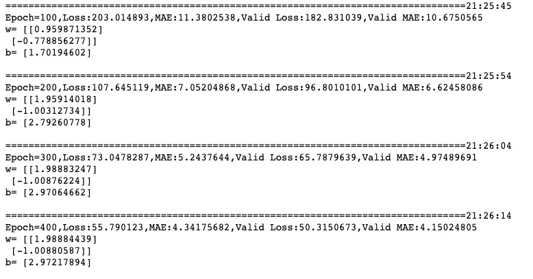

# 3-3 High-level API: Demonstration

The examples below use high-level APIs in TensorFlow to implement a linear regression model.

Typically, the high-level APIs are providing the class interfaces for `tf.keras.models`.

There are three ways of modeling using APIs of Keras: sequential modeling using `Sequential()` function, arbitrary modeling using API functions, and customized modeling by inheriting base class `Model`.

Here we are demonstrating using `Sequential()` function and customized modeling by inheriting base class `Model`, respectively.


### 1. Use `Sequential()` function to create a model sequencially (for the beginners)

```python
import tensorflow as tf
from tensorflow.keras import models,layers,optimizers

# Number of samples
n = 800

# Generate testing dataset
X = tf.random.uniform([n,2],minval=-10,maxval=10) 
w0 = tf.constant([[2.0],[-1.0]])
b0 = tf.constant(3.0)

Y = X@w0 + b0 + tf.random.normal([n,1],mean = 0.0,stddev= 2.0)  # @ represents matrix multiplication; add Gaussian noise
```

```python
tf.keras.backend.clear_session()

linear = models.Sequential()
linear.add(layers.Dense(1,input_shape =(2,)))
linear.summary()
```


```python
### Training with fit method

linear.compile(optimizer="adam",loss="mse",metrics=["mae"])
linear.fit(X,Y,batch_size = 20,epochs = 200)  

tf.print("w = ",linear.layers[0].kernel)
tf.print("b = ",linear.layers[0].bias)

```


```python

```

### 2. Customized modeling by inheriting base class `Model` (for the experts)

```python
import tensorflow as tf
from tensorflow.keras import models,layers,optimizers,losses,metrics


# Print time stamps
@tf.function
def printbar():
    ts = tf.timestamp()
    today_ts = ts%(24*60*60)

    hour = tf.cast(today_ts//3600+8,tf.int32)%tf.constant(24)
    minite = tf.cast((today_ts%3600)//60,tf.int32)
    second = tf.cast(tf.floor(today_ts%60),tf.int32)
    
    def timeformat(m):
        if tf.strings.length(tf.strings.format("{}",m))==1:
            return(tf.strings.format("0{}",m))
        else:
            return(tf.strings.format("{}",m))
    
    timestring = tf.strings.join([timeformat(hour),timeformat(minite),
                timeformat(second)],separator = ":")
    tf.print("=========="*8,end = "")
    tf.print(timestring)
    
```

```python
# Number of samples
n = 800

# Generate testing dataset
X = tf.random.uniform([n,2],minval=-10,maxval=10) 
w0 = tf.constant([[2.0],[-1.0]])
b0 = tf.constant(3.0)

Y = X@w0 + b0 + tf.random.normal([n,1],mean = 0.0,stddev= 2.0)  # @ represents matrix multiplication; add Gaussian noise

ds_train = tf.data.Dataset.from_tensor_slices((X[0:n*3//4,:],Y[0:n*3//4,:])) \
     .shuffle(buffer_size = 1000).batch(20) \
     .prefetch(tf.data.experimental.AUTOTUNE) \
     .cache()

ds_valid = tf.data.Dataset.from_tensor_slices((X[n*3//4:,:],Y[n*3//4:,:])) \
     .shuffle(buffer_size = 1000).batch(20) \
     .prefetch(tf.data.experimental.AUTOTUNE) \
     .cache()

```

```python
tf.keras.backend.clear_session()

class MyModel(models.Model):
    def __init__(self):
        super(MyModel, self).__init__()
        
    def build(self,input_shape):
        self.dense1 = layers.Dense(1)   
        super(MyModel,self).build(input_shape)
    
    def call(self, x):
        y = self.dense1(x)
        return(y)

model = MyModel()
model.build(input_shape =(None,2))
model.summary()

```


```python
### Customizing training loop (tutorial for the experts)


optimizer = optimizers.Adam()
loss_func = losses.MeanSquaredError()

train_loss = tf.keras.metrics.Mean(name='train_loss')
train_metric = tf.keras.metrics.MeanAbsoluteError(name='train_mae')

valid_loss = tf.keras.metrics.Mean(name='valid_loss')
valid_metric = tf.keras.metrics.MeanAbsoluteError(name='valid_mae')


@tf.function
def train_step(model, features, labels):
    with tf.GradientTape() as tape:
        predictions = model(features)
        loss = loss_func(labels, predictions)
    gradients = tape.gradient(loss, model.trainable_variables)
    optimizer.apply_gradients(zip(gradients, model.trainable_variables))

    train_loss.update_state(loss)
    train_metric.update_state(labels, predictions)

@tf.function
def valid_step(model, features, labels):
    predictions = model(features)
    batch_loss = loss_func(labels, predictions)
    valid_loss.update_state(batch_loss)
    valid_metric.update_state(labels, predictions)
    

@tf.function
def train_model(model,ds_train,ds_valid,epochs):
    for epoch in tf.range(1,epochs+1):
        for features, labels in ds_train:
            train_step(model,features,labels)

        for features, labels in ds_valid:
            valid_step(model,features,labels)

        logs = 'Epoch={},Loss:{},MAE:{},Valid Loss:{},Valid MAE:{}'
        
        if  epoch%100 ==0:
            printbar()
            tf.print(tf.strings.format(logs,
            (epoch,train_loss.result(),train_metric.result(),valid_loss.result(),valid_metric.result())))
            tf.print("w=",model.layers[0].kernel)
            tf.print("b=",model.layers[0].bias)
            tf.print("")
        
        train_loss.reset_states()
        valid_loss.reset_states()
        train_metric.reset_states()
        valid_metric.reset_states()

train_model(model,ds_train,ds_valid,400)

```




Please leave comments in the WeChat official account "Python与算法之美" (Elegance of Python and Algorithms) if you want to communicate with the author about the content. The author will try best to reply given the limited time available.

You are also welcomed to join the group chat with the other readers through replying **加群 (join group)** in the WeChat official account.


