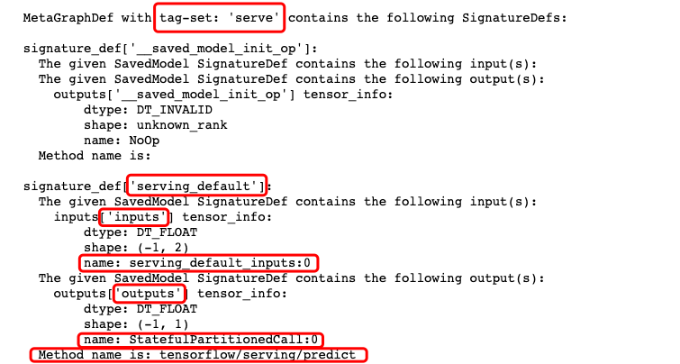

# 6-7,使用spark-scala调用tensorflow2.0训练好的模型

本篇文章介绍在spark中调用训练好的tensorflow模型进行预测的方法。

本文内容的学习需要一定的spark和scala基础。

如果使用pyspark的话会比较简单，只需要在每个executor上用Python加载模型分别预测就可以了。

但工程上为了性能考虑，通常使用的是scala版本的spark。

本篇文章我们通过TensorFlow for Java 在spark中调用训练好的tensorflow模型。

利用spark的分布式计算能力，从而可以让训练好的tensorflow模型在成百上千的机器上分布式并行执行模型推断。


```python

```

### 〇，spark-scala调用tensorflow模型概述


在spark(scala)中调用tensorflow模型进行预测需要完成以下几个步骤。

（1）准备protobuf模型文件

（2）创建spark(scala)项目，在项目中添加java版本的tensorflow对应的jar包依赖

（3）在spark(scala)项目中driver端加载tensorflow模型调试成功

（4）在spark(scala)项目中通过RDD在executor上加载tensorflow模型调试成功

（5） 在spark(scala)项目中通过DataFrame在executor上加载tensorflow模型调试成功


```python

```

### 一，准备protobuf模型文件


我们使用tf.keras 训练一个简单的线性回归模型，并保存成protobuf文件。

```python

```

```python
import tensorflow as tf
from tensorflow.keras import models,layers,optimizers

## 样本数量
n = 800

## 生成测试用数据集
X = tf.random.uniform([n,2],minval=-10,maxval=10) 
w0 = tf.constant([[2.0],[-1.0]])
b0 = tf.constant(3.0)

Y = X@w0 + b0 + tf.random.normal([n,1],mean = 0.0,stddev= 2.0)  # @表示矩阵乘法,增加正态扰动

## 建立模型
tf.keras.backend.clear_session()
inputs = layers.Input(shape = (2,),name ="inputs") #设置输入名字为inputs
outputs = layers.Dense(1, name = "outputs")(inputs) #设置输出名字为outputs
linear = models.Model(inputs = inputs,outputs = outputs)
linear.summary()

## 使用fit方法进行训练
linear.compile(optimizer="rmsprop",loss="mse",metrics=["mae"])
linear.fit(X,Y,batch_size = 8,epochs = 100)  

tf.print("w = ",linear.layers[1].kernel)
tf.print("b = ",linear.layers[1].bias)

## 将模型保存成pb格式文件
export_path = "../../data/linear_model/"
version = "1"       #后续可以通过版本号进行模型版本迭代与管理
linear.save(export_path+version, save_format="tf") 

```

```python

```

```python
!ls {export_path+version}
```

```python
# 查看模型文件相关信息
!saved_model_cli show --dir {export_path+str(version)} --all
```

```python

```

模型文件信息中这些标红的部分都是后面有可能会用到的。



```python

```

### 二，创建spark(scala)项目，在项目中添加java版本的tensorflow对应的jar包依赖

```python

```

如果使用maven管理项目，需要添加如下 jar包依赖

```
<!-- https://mvnrepository.com/artifact/org.tensorflow/tensorflow -->
<dependency>
    <groupId>org.tensorflow</groupId>
    <artifactId>tensorflow</artifactId>
    <version>1.15.0</version>
</dependency>
```

也可以从下面网址中直接下载 org.tensorflow.tensorflow的jar包

以及其依赖的org.tensorflow.libtensorflow 和 org.tensorflowlibtensorflow_jni的jar包 放到项目中。

https://mvnrepository.com/artifact/org.tensorflow/tensorflow/1.15.0


```python

```

```python

```

### 三， 在spark(scala)项目中driver端加载tensorflow模型调试成功


我们的示范代码在jupyter notebook中进行演示，需要安装toree以支持spark(scala)。

<!-- #region -->
```scala
import scala.collection.mutable.WrappedArray
import org.{tensorflow=>tf}

//注：load函数的第二个参数一般都是“serve”，可以从模型文件相关信息中找到

val bundle = tf.SavedModelBundle 
   .load("/Users/liangyun/CodeFiles/eat_tensorflow2_in_30_days/data/linear_model/1","serve")

//注：在java版本的tensorflow中还是类似tensorflow1.0中静态计算图的模式，需要建立Session, 指定feed的数据和fetch的结果, 然后 run.
//注：如果有多个数据需要喂入，可以连续使用多个feed方法
//注：输入必须是float类型

val sess = bundle.session()
val x = tf.Tensor.create(Array(Array(1.0f,2.0f),Array(2.0f,3.0f)))
val y =  sess.runner().feed("serving_default_inputs:0", x)
         .fetch("StatefulPartitionedCall:0").run().get(0)

val result = Array.ofDim[Float](y.shape()(0).toInt,y.shape()(1).toInt)
y.copyTo(result)

if(x != null) x.close()
if(y != null) y.close()
if(sess != null) sess.close()
if(bundle != null) bundle.close()  

result

```
<!-- #endregion -->

输出如下：

```
Array(Array(3.019596), Array(3.9878292))
```


```python

```

### 四，在spark(scala)项目中通过RDD在executor上加载tensorflow模型调试成功


下面我们通过广播机制将Driver端加载的TensorFlow模型传递到各个executor上，并在executor上分布式地调用模型进行推断。


<!-- #region -->
```scala
import org.apache.spark.sql.SparkSession
import scala.collection.mutable.WrappedArray
import org.{tensorflow=>tf}

val spark = SparkSession
    .builder()
    .appName("TfRDD")
    .enableHiveSupport()
    .getOrCreate()

val sc = spark.sparkContext

//在Driver端加载模型
val bundle = tf.SavedModelBundle 
   .load("/Users/liangyun/CodeFiles/master_tensorflow2_in_20_hours/data/linear_model/1","serve")

//利用广播将模型发送到executor上
val broads = sc.broadcast(bundle)

//构造数据集
val rdd_data = sc.makeRDD(List(Array(1.0f,2.0f),Array(3.0f,5.0f),Array(6.0f,7.0f),Array(8.0f,3.0f)))

//通过mapPartitions调用模型进行批量推断
val rdd_result = rdd_data.mapPartitions(iter => {
    
    val arr = iter.toArray
    val model = broads.value
    val sess = model.session()
    val x = tf.Tensor.create(arr)
    val y =  sess.runner().feed("serving_default_inputs:0", x)
             .fetch("StatefulPartitionedCall:0").run().get(0)

    //将预测结果拷贝到相同shape的Float类型的Array中
    val result = Array.ofDim[Float](y.shape()(0).toInt,y.shape()(1).toInt)
    y.copyTo(result)
    result.iterator
    
})


rdd_result.take(5)
bundle.close
```
<!-- #endregion -->

```python

```

输出如下：

```
Array(Array(3.019596), Array(3.9264367), Array(7.8607616), Array(15.974984))
```


```python

```

### 五， 在spark(scala)项目中通过DataFrame在executor上加载tensorflow模型调试成功


除了可以在Spark的RDD数据上调用tensorflow模型进行分布式推断，

我们也可以在DataFrame数据上调用tensorflow模型进行分布式推断。

主要思路是将推断方法注册成为一个sparkSQL函数。

<!-- #region -->
```scala
import org.apache.spark.sql.SparkSession
import scala.collection.mutable.WrappedArray
import org.{tensorflow=>tf}

object TfDataFrame extends Serializable{
    
    
    def main(args:Array[String]):Unit = {
        
        val spark = SparkSession
        .builder()
        .appName("TfDataFrame")
        .enableHiveSupport()
        .getOrCreate()
        val sc = spark.sparkContext
        
        
        import spark.implicits._

        val bundle = tf.SavedModelBundle 
           .load("/Users/liangyun/CodeFiles/master_tensorflow2_in_20_hours/data/linear_model/1","serve")

        val broads = sc.broadcast(bundle)
        
        //构造预测函数，并将其注册成sparkSQL的udf
        val tfpredict = (features:WrappedArray[Float])  => {
            val bund = broads.value
            val sess = bund.session()
            val x = tf.Tensor.create(Array(features.toArray))
            val y =  sess.runner().feed("serving_default_inputs:0", x)
                     .fetch("StatefulPartitionedCall:0").run().get(0)
            val result = Array.ofDim[Float](y.shape()(0).toInt,y.shape()(1).toInt)
            y.copyTo(result)
            val y_pred = result(0)(0)
            y_pred
        }
        spark.udf.register("tfpredict",tfpredict)
        
        //构造DataFrame数据集，将features放到一列中
        val dfdata = sc.parallelize(List(Array(1.0f,2.0f),Array(3.0f,5.0f),Array(7.0f,8.0f))).toDF("features")
        dfdata.show 
        
        //调用sparkSQL预测函数，增加一个新的列作为y_preds
        val dfresult = dfdata.selectExpr("features","tfpredict(features) as y_preds")
        dfresult.show 
        bundle.close
    }
}

```

<!-- #endregion -->

<!-- #region -->
```scala
TfDataFrame.main(Array())
```
<!-- #endregion -->

```
+----------+
|  features|
+----------+
|[1.0, 2.0]|
|[3.0, 5.0]|
|[7.0, 8.0]|
+----------+

+----------+---------+
|  features|  y_preds|
+----------+---------+
|[1.0, 2.0]| 3.019596|
|[3.0, 5.0]|3.9264367|
|[7.0, 8.0]| 8.828995|
+----------+---------+
```


以上我们分别在spark 的RDD数据结构和DataFrame数据结构上实现了调用一个tf.keras实现的线性回归模型进行分布式模型推断。

在本例基础上稍作修改则可以用spark调用训练好的各种复杂的神经网络模型进行分布式模型推断。

但实际上tensorflow并不仅仅适合实现神经网络，其底层的计算图语言可以表达各种数值计算过程。

利用其丰富的低阶API，我们可以在tensorflow2.0上实现任意机器学习模型，

结合tf.Module提供的便捷的封装功能，我们可以将训练好的任意机器学习模型导出成模型文件并在spark上分布式调用执行。

这无疑为我们的工程应用提供了巨大的想象空间。


如果对本书内容理解上有需要进一步和作者交流的地方，欢迎在公众号"Python与算法之美"下留言。作者时间和精力有限，会酌情予以回复。

也可以在公众号后台回复关键字：**加群**，加入读者交流群和大家讨论。


